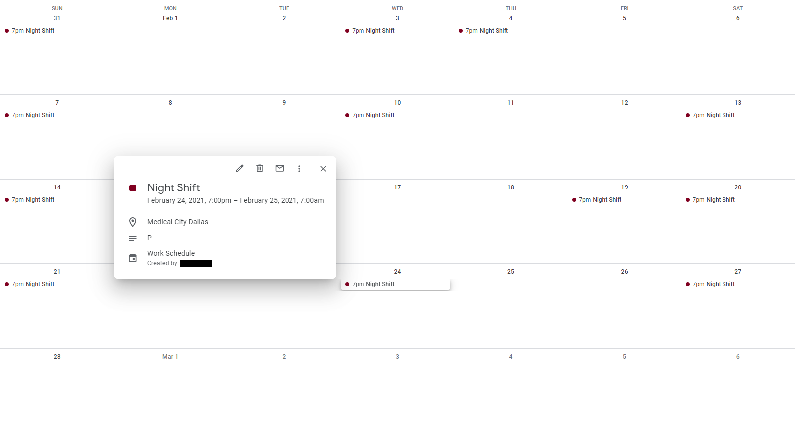

# Schedule to GCal

Schedule to GCal is a tool that retrieves an employee's work schedule from a HCA Healthcare facility and imports the schedule data to your Google Calendar using the Google Calendar API. Since this tool is deployed on AWS Lambda, the Google Calendar will automatically update if the employee's work schedule has been changed.

 


## Google Calendar API Documentation

The [Reference Documentation](https://developers.google.com/calendar/api/v3/reference/events) has all of the detailed usage information including all the public methods, parameters, and convenience initializers.

An event is an object associated with a specific date or time range. Events are identified by an ID that is unique within a calendar. Besides a start and end date-time, events contain other data such as summary, description, location, status, reminders, attachments, etc.

### Example of a Single Event

```Python
{
    'start': {
        'dateTime': "2021-02-24T19:00:00-05:00",
        'timeZone': 'America/Chicago'
    },
    'end': {
        'dateTime': "2021-02-25T07:00:00-05:00",
        'timeZone': 'America/Chicago'
    },
    'summary': "Night Shift",
    'description': "P",
    'location': "Medical City Dallas"
}
```
